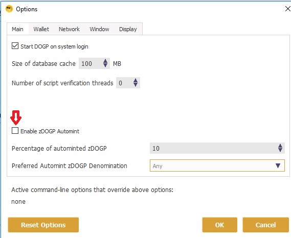
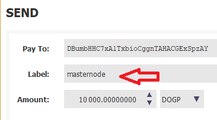

# DogP Masternode Setup Guide

## Introduction
This guide is for a single masternode, on a Ubuntu 18.10 64bit server (VPS) running headless and will be controlled from the wallet on your local computer (Control wallet). The wallet on the the VPS will be referred to as the Remote wallet.
You will need your server details for progressing through this guide.

First the basic requirements:
- 10,001 DogP
- A main computer (Your everyday computer) – This will run the control wallet, hold your collateral 10,000 DogP and can be turned on and off without affecting the masternode.
  - pick a suitable version for your os [here](https://github.com/PrivateDOGP/Dogecoin-Private-Core-Repository/releases)
- Masternode Server (VPS – The computer that will be on 24/7)  
  - You can order a vps at [contabo.com](https://contabo.com/?show=vps)
- A unique IP address for your VPS / Remote wallet
  - You will get those from your hosting party.

(For security reasons, you’re are going to need a different IP for each masternode you plan to host)

The basic reasoning for these requirements is that, you get to keep your DogP in your local wallet and host your masternode remotely, securely.

## Configuration
Note: The auto zDogP minter should be disabled during this setup to prevent autominting of your masternode collateral. BEFORE unlocking your wallet, you can disable autominting in the control wallet option menu. This can be found in the wallet (Settings > Main)



1. Using the control wallet, enter the debug console (Tools > Debug console) and type the following command:
```
masternode genkey
```
This will be the masternode’s privkey. We’ll use this later…

2. Using the control wallet still, enter the following command:
```
getaccountaddress chooseAnyNameForYourMasternode
```
3. Still in the control wallet, send 10,000 DogP to the address you generated in step 2 (Be 100% sure that you entered the address correctly. You can verify this when you paste the address into the “Pay To:” field, the label will autopopulate with the name you chose”, also make sure this is exactly 10,000 DogP; No less, no more.)

 - Be absolutely 100% sure that this is copied correctly. And then check it again. We cannot help you, if you send 10,000 DogP to an incorrect address.  


4. Still in the control wallet, enter the command into the console:
```
masternode outputs
```
 - Please note that this might take a minute or two as your tranaction needs to be confirmed by the network (max 6 confirmations). This gets the proof of transaction of sending 10,000 DogP.


5. Still on the main computer, find your masternode configuration file.
  - On windows you can go to the controller wallet and open the file from there  
   (Tools > Open Masternode Configuration File)
  - On Linux you can type the following in your terminal
```bash
nano ~/.dogecoinprivate/dogecoinprivate.conf
```
Add the following line to the configuration file:
```
<Name of Masternode(Use the name you entered earlier for simplicity)> <Unique IP address>:21472 <The result of Step 1> <Result of Step 4> <The number after the long line in Step 4>
```
```
Example: MN1 31.14.135.27:51472 892WPpkqbr7sr6Si4fdsfssjjapuFzAXwETCrpPJubnrmU6aKzh c8f4965ea57a68d0e6dd384324dfd28cfbe0c801015b973e7331db8ce018716999 1
```
Substitute it with your own values and without the “<>”s  
after this step is finished make sure to restart your controller wallet.
    - On windows just open close the QT wallet and restart it.
    - On linux you can close the QT (if your using it) or restart the daemon.  
    Go to the directory where the daemon is
    ```bash
    cd /dir/to/dogp/daemon
    ```
    stop the daemon
    ```bash
    ./dogecoinprivate-cli stop
    ```
    to start it again use
    ```bash
    ./dogecoinprivate -deamon
    ```


## VPS Remote wallet install
First you need to connect to your vps.
 - On windows you can use putty for that [putty.org](https://www.putty.org/)
 - On linux you can use the terminal for this.
 ```bash
 ssh username@127.0.0.1
 ```
    Use the details that your hosting party gave you.

6. Install the latest version of the DogP wallet onto your masternode. The lastest version can be found here: [DogP releases](https://github.com/PrivateDOGP/Dogecoin-Private-Core-Repository/releases)
 - Go to your home directory:
 ```bash
 cd ~
 ```
 - From your home directory, download the latest version from the DogP GitHub repository to get the latest verion copy the link for linux from step 6.  
 ** Note this is an example url always make sure you have the latest verion! **
 ``` bash
 wget https://github.com/PrivateDOGP/Dogecoin-Private-Core-Repository/releases/download/v1.0.0/dogecoinprivate-x86_64-linux-gnu.tar.gz
 ```
 - Unzip and extract:
 ```bash  
 tar xf dogecoinprivate-x86_64-linux-gnu.tar.gz
 ```
 - Go to your DogP bin directory:
 ```bash
 cd ~/dogecoinprivate/bin/
```
 - Note: If this is the first time running the wallet in the VPS, you’ll need to start the wallet
 ```bash
 ./dogecoinprivated
 ```
    this will place the config files in your ~/.dogecoinprivate data directory
    - press
    ```
    CTRL + C
    ```
    to exit / stop the wallet then continue to step 7

## Configuration Cont.
7. Now on the masternodes, find the DogP data directory here.(Linux: ~/.dogecoinprivate)
```bash
cd ~/.dogecoinprivate
```
8. Open the dogecoinprivate.conf by typing
```bash
nano dogecoinprivate.conf
```
 - Add the following lines to the file.
 ```
rpcuser=long random username
rpcpassword=longer random password
rpcallowip=127.0.0.1
server=1
daemon=1
logtimestamps=1
maxconnections=256
masternode=1
externalip=your unique public ip address
masternodeprivkey=Result of Step 1
addnode=185.248.140.111:31472
addnode=37.187.135.212:31472
addnode=35.245.144.95:31472
addnode=193.29.56.203:31472
addnode=185.243.115.33:31472
addnode=95.179.131.10:31472
addnode=45.77.115.11:31472
addnode=35.221.27.134:31472
addnode=140.82.57.187:31472
addnode=185.250.204.28:31472
addnode=77.55.220.45:31472
```
Make sure to replace rpcuser and rpcpassword with your own.


9. to exit nano press
```
CTRL + X
```
then
```
Y
```
then
```
ENTER
```
 Now restart your controller wallet so you can start the masternode.

## Start your masternode
10. Now, you need to finally start these things in this order
 - Start the daemon client in the VPS. First go back to your installed wallet directory,
```bash
cd ~/dogecoinprivate/bin/
```
and then start the wallet using
```bash
./dogecoinprivated
```
 - From the Control wallet debug console
```
startmasternode alias false <mymnalias>
```
where <mymnalias> is the name of your masternode alias (without brackets).
The following should appear:
```
“overall” : “Successfully started 1 masternodes, failed to start 0, total 1”,
“detail” : [
{
“alias” : “<mymnalias>”,
“result” : “successful”,
}
```
  if you get an error saying that the alias is not found then make sure you typed it correctly by opening the masternode configuration file like in step 5. if this is correct make sure to restart the wallet.

 - Back in the VPS (remote wallet), start the masternode
```bash
./dogecoinprivate-cli startmasternode local false
```
 - A message “masternode successfully started” should appear, this might take some time (up to 30 minutes).  


11. Use the following command to check status:
```bash
./dogecoinprivate-cli masternode status
```
You should see something like:
```
{
“txhash” : “334545645643534534324238908f36ff4456454dfffff51311”,
“outputidx” : 0,
“netaddr” : “45.11.111.111:51472”,
“addr” : “D6fujc45645645445645R7TiCwexx1LA1”,
“status” : 4,
“message” : “Masternode successfully started”
}
```
Congratulations! You have successfully created your masternode!

Now the masternode setup is complete, you are safe to remove “enablezeromint=0” from the dogecoinprivate.conf file of the control wallet.

## Tearing down a Masternode
1. How do I stop running MN1 on my VPS hoster and delete MN1 from my dogecoinprivate Core – Wallet’?
 > 1) From the masternode to stop the wallet.  
 ```bash
 ./dogecoinprivate-cli stop
 ```
 > 2) Then from your controller wallet PC, edit your masternode.conf, delete the MN1 masternode line entry.  
 > 3) Now restart the controller wallet.  
 > 4) your 10K will now be unlocked.  
2. How do I get the 10k back that I’ve send to my MN1 address at the beginning of the MN1 setup?
 > You don’t need to “get that back” as it is already in your wallet.
Being in the different address is not an issue as that’s also your address.
3. Can I use this 100k normally on my wallet then again, and sell it or stake it normally like before?
 > yes!
